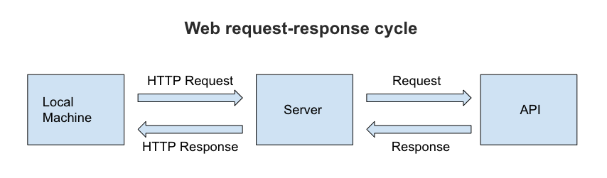

# City Explorer API

**Author**: Mathew Torres
**Version**: 1.0.0 (increment the patch/fix version number if you make more commits past your first submission)

## Overview

This is a web application that allows users to search for a location by city name and view the location on a map.  Lattitude and longitude are displayed for the specified location.

## Getting Started

1. CLone the repository from GitHub.
2. Run `npm install` to install all dependencies.
3. Run `npm start` to start the server.
4. Navigate to `localhost:3000` in your browser.

## Architecture

This application uses the following technologies:

* React
* Bootstrap
* Node.js
* Axios

## Change Log

09-29-2022 6:00pm - Application has component and module structure.
09-27-2022 10:15pm - Application server is now deployed to Heroku.
09-27-2022 10:00pm - Application now has a fully-functional express server, with a GET route for the location resource.
09-26-2022 9:00pm  - Application now has a fully-functional node server, with a GET route for the location resource.

<!-- Use this area to document the iterative changes made to your application as each feature is successfully implemented. Use time stamps. Here's an example:

01-01-2001 4:59pm - Application now has a fully-functional express server, with a GET route for the location resource. -->

## Credit and Collaborations
<!-- Give credit (and a link) to other people or resources that helped you build this application. -->

## Lab 10

Name of feature: Add Cache to Backend

Estimate of time needed to complete: 2 hours

Start time: 2pm

Finish time: 3:30pm

Actual time needed to complete: 1.5 hours

### Image of Web Request-Response Cycle

## Lab 9

Name of feature: Componentize Front End

Estimate of time needed to complete: 3 hours

Start time: 3pm

Finish time: 6pm

Actual time needed to complete: 3 hours

---

Name of feature: Modularize Backend

Estimate of time needed to complete: 3 hours

Start time: 1pm

Finish time: 3pm

Actual time needed to complete: 2 hours

## Lab 8

Name of feature: Weather Live

Estimate of time needed to complete: 3 hours

Start time: 1pm

Finish time: 6pm

Actual time needed to complete: 5 hours

---

Name of feature: Movies

Estimate of time needed to complete: 3 hours

Start time: 7pm

Finish time: 9pm

Actual time needed to complete: 2 hours

---

Name of feature: Deployment

Estimate of time needed to complete: 1 hours

Start time: 9pm

Finish time: 10pm

Actual time needed to complete: 1 hour

### Image of Web Request-Response Cycle

## Lab 7

Name of feature: Setup server

Estimate of time needed to complete: 3 hours

Start time: 2pm

Finish time: 6pm

Actual time needed to complete: 4 hours

## Lab 6

Name of feature: Locations

Estimate of time needed to complete: 2 hours

Start time: 1pm

Finish time: 3pm

Actual time needed to complete: 2 hours

---
Name of feature: Map

Estimate of time needed to complete: 2 hours

Start time: 3pm

Finish time: 5pm

Actual time needed to complete: 2 hours

---

Name of feature: Errors

Estimate of time needed to complete: 2 hours

Start time: 5pm

Finish time: 6pm

Actual time needed to complete: 1 hours

### Image of Web Request-Response Cycle

